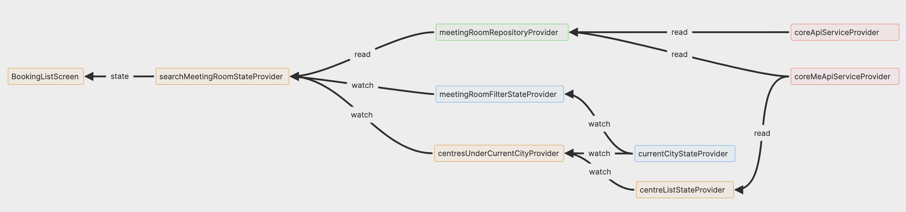

# my_tec_listing_module_app

This repository is a demo of a interview process with TEC. 

The goal is to create a Flutter-based meeting room listing module with filtering capabilities and robust state management. This is a core booking feature that helps users discover and filter available meeting rooms.

This project depends on *dio, riverpod, flutter_hooks, json_serializable, extended_image*, and some of the packages they depend on.

## Features

- [x] API integration with the TEC REST API provided
- [x] Browse meeting room data and coworking data.
- [x] State management with Riverpod and flutter_hooks(hooks_riverpod)  
- [x] Filtering capabilities with date, time, capacity, centres,
- [x] Responsive UI with map and list mode

## Setup

### Prerequisites

- Flutter SDK 3.32.4

### How to run

Install dependencies

```bash
flutter pub get
```

Generate code (for JSON serialization and Riverpod providers)

```bash
# For development, watch for changes
dart run build_runner watch -d

# or just build once
dart run build_runner build
```

Run the app with the access key

- Please open up simulator in prior

```bash
# For development
flutter run --dart-define=ACCESS_KEY={{your_access_key}}

# if you want to run on a specific device
flutter devices
flutter run --dart-define=ACCESS_KEY={{your_access_key}} -d {{device_id}}
```

### How to build

```bash
flutter build ios --release
flutter build apk --release

# iOS (if deployable package is needed)
flutter build ipa
```

## Architecture Overview

This project follows a layered architecture with Clean Architecture principles partially applied at an appropriate level for its scale, to provide clear separation of concerns.

### **Project Structure**

```plaintext
lib/
├── core/                    
│   ├── networks/           # Network clients and providers
├── data/                   # Data layer
│   ├── api/               # API service definitions
│   └── dto/               # Data Transfer Objects
├── domain/                # Domain layer (business logic)
│   ├── entities/          # Business entities
│   └── repositories/      # Repository implementations
├── presentation/          # Presentation layer
│   ├── providers/         # State management (Riverpod providers)
│   ├── screens/           # UI screens
│   └── widgets/           # Reusable UI components
├── utils/                 # Utility functions
├── app.dart               # Entry point
└── app_theme.dart         # Theme and style definitions
```

### Key Architecture Decisions

1. Clean Architecture Layers
   - Domain Layer: Contains business entities, but repository is not contracted as interface.
   - Data Layer: Implements repositories, handles API calls and data transformation
   - Presentation Layer: Manages UI state with Riverpod providers

2. State Management
   - Using **Riverpod**: For dependency injection and app-level state management. Started with Provider as state management tool, but eventually changed to Riverpod for more usability it provides.
   - Using **Flutter Hooks**: For local-level UI state management and side-effects.

3. Network Layer
   - Dio: HTTP client with interceptors for logging
   - Two API endpoints: Core API and CoreMe API

4. Data Serialization
   - json_serializable/json_annotation: For automatic JSON de-serialization of API responses

5. UI Components
   - Accessing app-level state from screen level as much as possible to reduce the complexity of the maintaining state logic in the widget level.
   - Created theme tokens for the app to make it easier to change the theme of the app in the future, and centralize the theming.

#### Key Components

- MeetingRoomRepository: Central business logic for meeting room data, mainly to **integrate 3 different API endpoints, filter, and return a combined data structure** to the presentation layer.
- API Services: CoreApiService and CoreMeApiService for different endpoints
- DTOs: Type-safe data transfer objects with JSON de-serialization
- Entities: Business domain models
- UI Components
  - booking_list_screen: The main screen for booking meeting room data. It includes 4 tabs which will trigger user to navigate within the screen. The screen includes a **draggable bottom sheet**, which is a key of the UX in this page.
  - form-related widgets: Custom widgets for form-related UI components
  - filter_bottom_sheet: A bottom sheet for filtering meeting room data. Always triggered to be shown when the user change the tab as well.
  - meeting_room_list_view: A list view for meeting room data.

### Riverpod Provider Dependency

This is one of the example to assist understanding the dependency of the providers:



### Blocker for DraggableScrollableSheet

The booking_list_screen implements a draggable bottom sheet interface using `DraggableScrollableSheet` that allows users to seamlessly switch between map and list views. However, there were several challenges in implementing smooth scroll interactions:

#### 1. Scroll Interaction Challenge

- Initially, the list view of room cards was not scrollable when DraggableScrollableSheet was not fully expanded
- This occurred because DraggableScrollableSheet's drag gesture changes its size until reaching a limit before allowing scrolling
- If maxChildSize limit (1.0) is not reached, scrolling cannot start

#### 2. Solution: Separating Scroll Behaviors

- Separated the scrolling of the sheet and list view by:
  1. Wrapping ListView in a CustomScrollView inside the sheet
  2. Having CustomScrollView use the `DraggableScrollableSheet`'s `scrollController` instead of ListView (of cards) using it.
  3. This allows ListView to scroll independently regardless of sheet size
- The key was understanding that if a widget doesn't use `DraggableScrollableSheet`'s `ScrollController`, the sheet remains at its initial size, allowing for independent scroll interactions.
- Used SliverLayoutBuilder to ensure nested ListView can scroll regardless of sheet size:
  1. SliverLayoutBuilder calculates amount of space for available height
  2. This makes sheet think it's always fully expanded from its perspective
  3. Enables smooth scrolling of nested ListView even when sheet is partially expanded

#### 3. Drag Bar Interaction

- When sheet is at maxSize, the drag bar is hidden but users could still trigger sheet resizing
- Added GestureDetector to override vertical scroll events when appropriate


#### Navigation & Routing

- Named Routes: Simple route-based navigation with typed parameter passing between screens

## Assumptions and Known Issues

### **API Assumptions**

- Some of the API repsonse data's fields are declared as optional to handle null-related issues since cannot access API spec.

### **Known Issues**

- No pagination for large room lists and necessary room data loaded at once (Performance Concerns)
- Draggable sheet's scrolling behavior may not be consistent
- Limited error handling implementation
- Some debug print statements left in production code
- Missing unit tests.
- Multi-language infrastructure not existing, some UI strings are hardcoded

### Improvement Points

- Optimized the provider dependencies since the current implemenation may not be easy to understand, and also maintain.
- Break UI components into smaller components to make it easier to maintain.
- Write unit tests.


## UI/UX Differences from original app

1. To display how many meeting rooms are fetched from server based on the filter, a snackbar is displayed when the search    data is fetched.
2. The filter bottom sheet will display the dialogs for specific filter when the user taps on the filter chip about specific filter field.


